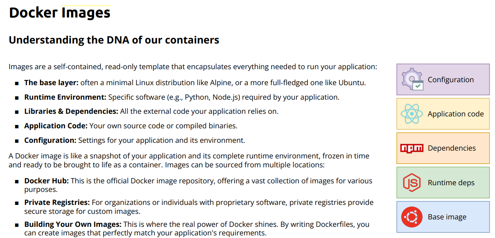

# Docker Notes

## Docker Basics

To know the version  
`docker --version`

To check if docker is running  
`docker run hello-world`

### Container

To run a container  
`docker run <container_name>`

#### Options 

- `-d` to make it run in the back ground: `docker run -d <container_name>`
- `--name` to give the container a custom name: `docker run --name 'my_container' <container_name>`
- `-p` to specify a port: `docker run -p 8080:80 <container_name>` 
- `-e VARIABLE=VALUE` To set an environment variable 
- `--rm ` To remove the container after the run

To check the running containers  
`docker ps`

To kill a container  
`docker kill <container_name>`

To stop a container - gives time for the process to close properly   
`docker stop <container_name>`

To pause a container  
`docker pause <container_name>`

To unpause a container  
`docker unpause <container_name>`

### Pull Images

To install a docker image  
`docker pull <image>`

To install a certain version  
`docker pull <image>:<version>`

### List

To list the current running containers  
`docker ps`

To list all containers  
`docker ps -a`

### Remove images

To remove an image  
`docker image remove <image>` or `docker rmi <image>

To remove an image, it must have no container instance of it.

To remove an image forcefully  
`docker image remove -f <image>`

### Remove Container

To delete/Remove a container  
`docker remove <container_ID>`


### Logs

To read the logs of a container  
`docker logs <container_name>`

You can read the logs live  
`docker logs -f <container_name>`

### Interact with the container

You can execute commands inside the container  
`docker exec -it <container_name> <command>`

To open an interactive shell with the container  
`docker exec it <container> /bin/bash`

To install a package inside a container  
`apt-get install <package>`

### Build Containers

To build a container follow the steps below

1-  Create a file `Dockerfile`

2-  Inside that file write the docker instructions  
```
FROM <image>
CMD ["echo","Hello there, i am a running image"]
```
3- Run `docker build .` . This means that build from the instruction file that is here. Docker will search for the `Dockefile` and execute what is inside it.

4- Check the container ID from `docker ps`

5- Run the container `docker run <container_ID>`

### Tags

To Tag a new created image  
`docker tag <Image>:<Tag> <username>/<New_Name>:<Tag>`

### Push

To push an image to your own repo on Dockerhub  
`docker push <username>/<name>:<tag>`

### Help

To know the available commands  
`docker --help`

To know get the help for a specific command  
`docker <command> --help`

### Search

To search for an image  
`docker search <name>`

### Login

To login into the docker hub through the terminal.  
`docker login`

## Docker Images




## Dockerfiles

A `Dockerfile` is a file that programmically defines the steps for the creation of an image. It helps in
- Reproducibility
- Automatation
- Transparency and Documentation
- Optimization

## Syntax

The file is a set of instructions, each instruction is executed

`FROM`: To specify the image you want to build from
`RUN`: execute the command inside the container once built

## Build

Steps to build a container:

1. `Docker build -t <name> .`
2. `Docker run <name>`

To build an the container:
`docker build .`

### Options:

`-t <name>` To give the created image a tag

### Environmnet Variables

To define an environment variable, you must define it in the `Dockerfile` as:

`ENV VARIABLE=VALUE` example  
`ENV PORT=3000`

### CMD vs ENTRYPOINT

In CMD, you can overwrite the command in the `build command`.

Example:

Assume we have the below CMD command in the `Dockerfile`  
`CMD ["echo" , "Hello from CMD in Dockerfile.cmd"]`

and we build an image then run a coontainer:

`docker build -t cmd-example .`  
`docker run --rm cmd-example`

the output will be:  
`Hello from CMD in Dockerfile.cmd`

if we run the command  
`docker run --rm cmd-example echo "Hello, i am superior"`  

the output will be  
`Hello, i am superior`

and it will overwrite the CMD echo command.

In ENTRYPOINT, you cannot overwrite the command unless you implicitly add the `--entrypoint` option. Any extra string will be added to the command.

Example:

we have the below command in the `Dockerfile`

`ENTRYPOINT [ "echo" , "Hello from ENTRYPOINT in Dockerfile.entrypoint" ]`

Then we build an image and run a container  
`docker build -t entrypoint-example .`  
`docker run --rm entrypoint-example`

the output will be  
`Hello from ENTRYPOINT in Dockerfile.entrypoint`

But if we run the below command:

`docker run --rm entrypoint-example "Hello, i am equal"`

the output will be  
`Hello from ENTRYPOINT in Dockerfile.entrypoint Hello, i am equal`
